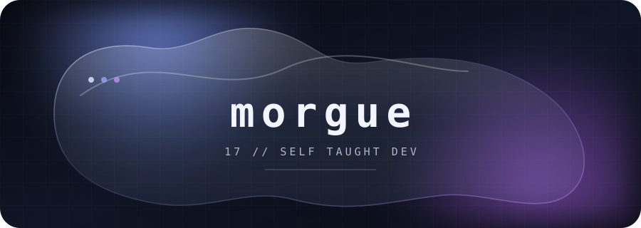

 

<code>when hell is full, the dead will walk the earth</code>

  

&nbsp;

 

### `01 // TOOLKIT`

 

### `02 // SIGNAL`

<picture>
  <source media="(prefers-color-scheme: light)" srcset="https://github-readme-stats.vercel.app/api?username=21morgue&show_icons=true&hide_border=true&bg_color=00000000&title_color=526985&text_color=65738a&icon_color=708cff&ring_color=708cff" />
  
</picture>
<picture>
  <source media="(prefers-color-scheme: light)" srcset="https://streak-stats.demolab.com?user=21morgue&hide_border=true&background=00000000&ring=708cff&fire=ad75e8&currStreakLabel=526985&sideLabels=65738a&dates=8791a3&currStreakNum=526985&sideNums=526985" />
  
</picture>

  

 

### `03 // ACTIVITY`

somewhere between an idea and a commit.

